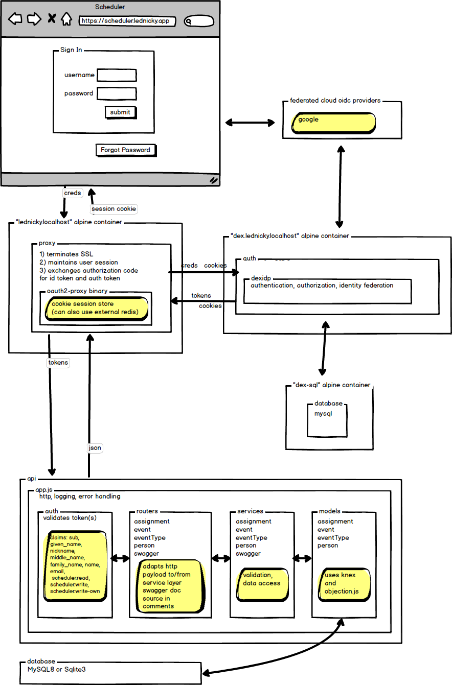

scheduler-api-objection-node
============================

- [scheduler-api-objection-node](#scheduler-api-objection-node)
  - [Overview](#overview)
  - [Domain](#domain)
  - [Architecture](#architecture)
  - [Running the Application](#running-the-application)
    - [Preparation](#preparation)
      - [secrets](#secrets)
      - [hosts file](#hosts-file)
      - [certificates](#certificates)
    - [Startup](#startup)
    - [Seeding the Dex User database](#seeding-the-dex-user-database)
    - [Seeding the API database](#seeding-the-api-database)
  - [Running Tests](#running-tests)
    - [Jest](#jest)
    - [Postman](#postman)


Overview
--------
This is a sample project I've been using to learn API development in the node ecosystem. Technologies include:

- **MySql** for storing data
- **sqlite3** for storing data used by automated integration tests
- **Knex.js** querybuilder used by Objection
- **Objection.js** bare-bones ORM for Node.js
- **express** node http server
- **jest / supertest** for automated tests
- **postman** for manual integration tests
- **swagger-jsdoc** and **swagger-ui-express** to generate and display OpenAPI 3 API specification
- **Docker** to stand up the five services needed for authentication and running the API
- **OAuth/OIDC** for authentication
- **jose** for JWT validation
- **Balsamiq** for documentation drawings

I've set this aside to work on React, but intend to add the following:
- Typescript
- A React frontend
- Kubernetes
- Google Cloud Platform deployment from Github


Domain
------------------
The API is intended to back a simplified "scheduling" application where events can be placed on a calendar and people can be assigned to them. The entities are:

- **event type:** This is an activity that can be scheduled on the calendar multiple times (i.e. "lunch" can be scheduled on multiple days).
- **event:** An event type that has been scheduled (i.e."lunch" on Nov. 30, 2021 from 11:30 AM to 12:30 PM). This date/time values are qualified by a timezone, which is constrained by a list of **timezones**.
- **person:** A person who can be assigned to an event.
- **assignment:** The association of a person to an event.

Architecture
------------
The API was very simple until I reached authentication. I could easily implement a local username/password authentication, but reached instead for the best-practice OAuth/OIDC pattern. A few months later, I had an authenticating proxy backed by a local federating OAuth/OIDC provider. This has the features I need to test token authentication in the API layer, but the login sequence between the proxy and the provider doesn't really meet my expectations, so it might be rewritten again using https://github.com/panva/node-oidc-provider and https://github.com/http-party/node-http-proxy



Running the Application
-----------------------

### Preparation

#### secrets
MySql database names and passwords are mounted into the Docker instances as volumes. The mounted files must be created locally, since they are not checked in. Each secret is contained in its own file. Files are in screaming snake case with no extension. You can choose any legal username and password. There are two secrets directories: one for the API and one for Dex.

- ./config/MYSQL_USERNAME
- ./config/MYSQL_PASSWORD
- ./config/MYSQL_ROOT_PASSWORD

- ./proxy/config/MYSQL_USERNAME
- ./proxy/config/MYSQL_PASSWORD
- ./proxy/config/MYSQL_ROOT_PASSWORD

---------------------
To leave the committed configuration files unchanged, the application must be addressed as:
https://lednicky.localhost
If you want to skip configuring your hosts file, you can update the paths in `\proxy\oauth2-proxy\oauth2-proxy.config.yaml` and `\proxy\dex\dex.config.yaml`.

#### hosts file
Add this to your hosts file:
```
127.0.0.1  lednicky.localhost
127.0.0.1  dex.lednicky.localhost
```
For instructions on how to do this on Windows 10, see https://superuser.com/a/1120395

#### certificates

Create a self-signed wildcard certificate for ***lednicky.localhost** 

NOTE: Take special care to make sure this is a wildcard certificate, since it is used for both https://lednicky.localhost and https://dex.lednicky.localhost

> For instructions on how to do this on Windows 10, see https://stackoverflow.com/questions/21397809/create-a-trusted-self-signed-ssl-cert-for-localhost-for-use-with-express-node

Create the following file and put the public key in it:
**./proxy/config/lednicky.localhost.crt**

Create the following file and put the decrypted private key in it:
**./proxy/config/lednicky.localhost.decrypted.key**

Both the proxy and dex will pick up these files and configure themselves correctly.

This is easy to get wrong.

The proxy and the postman tests have been configured to ignore invalid SSL certificates to eliminate some of the problems associated with this configuration.

### Startup

To build and stand up the API (on port 3333) and the proxy (on port 443)

Make sure Docker Desktop is running first and then execute this command:

`docker-compose up -d --build` 

The MySql container reports itself as ready before the database can receive connections. Dex frequently errors out on startup with an error about being unable to access the database. You can restart the dex container by itself after the environment is running with the following command: `docker-compose restart dex`.

The swagger documentation from the API layer does not require authentication, so you should be able to navigate directly to:

https://lednicky.localhost/api/api-doc/
https://lednicky.localhost/api/api-doc-ui/

After you've authenticated, you can call this API diagnostic endpoint to see the JWT:

https://lednicky.localhost/api/inspectRequest/headers

### Seeding the Dex User database

You won't be able to log into Dex locally until there are users in the Dex database. To do that, log into the dex-sql database docker container (named "dex-sql"), run MySql, then execute the script to insert the test users.

Open the shell:
```
docker exec -it dex-sql sh
```

From the shell command prompt, login as root to MySql
```
# mysql -u root -p
```
When prompted, enter the password you created for the root user of the dex database.

From the resulting command prompt, you can paste the contents of /proxy/test-users/test-users.sql

That file creates test users as follows.
```
 +------------------+------------------+---------+
 | email            | username         | user_id |
 +------------------+------------------+---------+
 | ann@dot.com      | ann.abbot        | 1       |
 | bob@dot.com      | bob.boebert      | 2       |
 | carol@dot.com    | carol.cruz       | 3       |
 | dan@dot.com      | dan.dinkle       | 4       |
 | erin@dot.com     | erin.emmerlin    | 5       |
 | federico@dot.com | federico.fuentes | 6       |
 +------------------+------------------+---------+
 password is the first name in lowercase
```
Get out of MySql by typing "quit", then get out of the container by typing "exit"

See more at [db/migrations/migrations.notes.md](db/migrations/migrations.notes.md)

### Seeding the API database

The API won't work at all until the schema has been created. It won't do anything useful until it has been seeded with data. Do that by logging into the API container (named "app") and running knex migrations and seeds.

Open the shell:
```
docker exec -it app sh
```
From the prompt, run the migrations, which set up the tables in the database:
```
npx knex migrate:latest
```

From the prompt, run the seeds, which populates the tables with test data:
```
npx knex seed:run
```

For a description of the test data, see [db/seeds/seeds.notes.md](db/seeds/seeds.notes.md)

Running Tests
-------------

### Jest

Run jest tests with the following command from the root of the project:
```
yarn test
```

### Postman

Postman test exports can be found at /tests/postman

For details, see [tests/postman/postman.tests.md](tests/postman/postman.tests.md);

