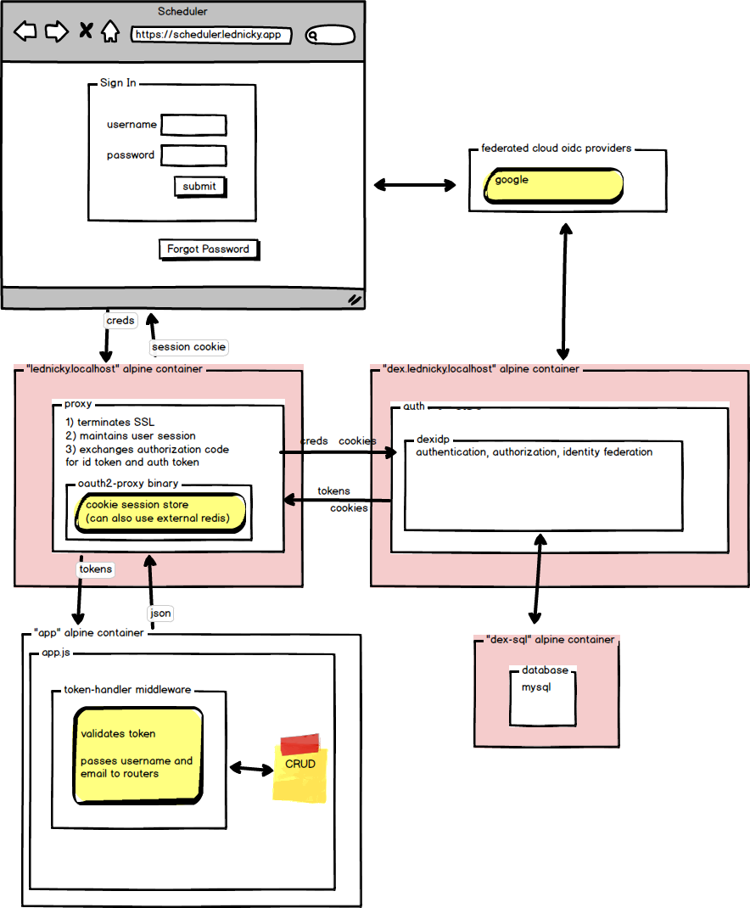

Authenticating Proxy
====================

This folder contains the resources needed to stand up an authenticating proxy based on an OAuth2/OIDC provider.

Dex
---

The OAuth2/OIDC provider is a Dex Docker image run with a configuration file. It is backed by a MySQL database. 

Dex documentation is at https://dexidp.io/

oauth2-proxy
------------

The authenticating proxy is an oauth2-proxy Docker image built from source run with a configuration file. It uses encrypted session cookies to store state. The image is built from source solely to include a self-signed certificate in ca-certificates.crt. I'll probably omit the SSL between oauth2-proxy and dex, simplifying the deployment and using the pre-built oauth2-proxy image at quay.io/oauth2-proxy/oauth2-proxy .

oauth2-proxy documentation is at https://oauth2-proxy.github.io/oauth2-proxy/

Diagram
-------

The proxy/docker-compose.yml will stand up a stack including only the pink hosts in the diagram below.

How To
======

### Create proxy image
Create an oauth2-proxy image that trusts the self-signed cert in config:

`docker build -t lednicky/oauth2-proxy -f ./oauth2-proxy/oauth2-proxy-Dockerfile .`

Note: The image is prefixed with my dockerhub username, but this is not required.

### Stand up a proxy environment for testing:

`docker-compose up -d`

### View logs:

After running docker-compose stack, view combined logs:

`docker-compose logs`

Or only the proxy logs: 

`docker-compose logs oauth2-proxy`

Or only the dex logs: 

`docker-compose logs dex`

Add the -f parameter to tail the logs:

`docker-compose logs -f`

`docker-compose logs oauth2-proxy -f`

`docker-compose logs dex -f`

### Shell into container

To get a shell on the mysql container, for example, run this command:

`docker exec -it dex-sql sh`

### Seed users

The \proxy\test-users directory contains test-users.sql, which inserts six test users into the Dex MySql database.

It also contains a test utility to create users following the same convention as those six. To create a user named "gary" call it like this:

`node hash-password.js gary`

It returns the word "gary" hashed and then an insert statement that looks like this:

`insert into password (email, hash, username, user_id) values ("gary@dot.com","$2b$10$MiGj5yay4pJMyvWwM6zFg.o7o.aSJdgQZfYM8L2XlC4tUp2qGdxJ.", "gary", 0);`

Gary's email is gary@dot.com. Gary's username is "gary". Gary's password is "gary".  You'll need to replace the zero with a unique number for user_id.

 